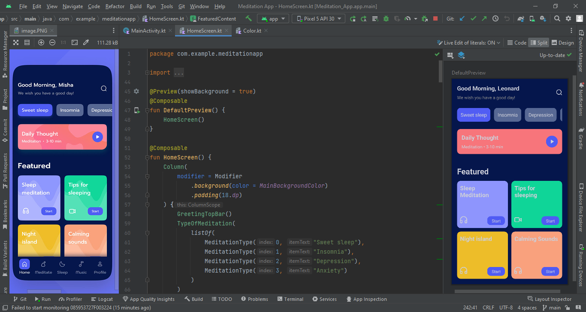

# Meditation-App
Making a Meditation App, using a UI from Dribble.
This was made using Jetpack Compose and for now it would in-cooperate just the UI,
the functionality will be added later in the project

## Prerequisite
To build this project, you will require:
* Android Studio
* Jetpack Compose

## ScreenShots
